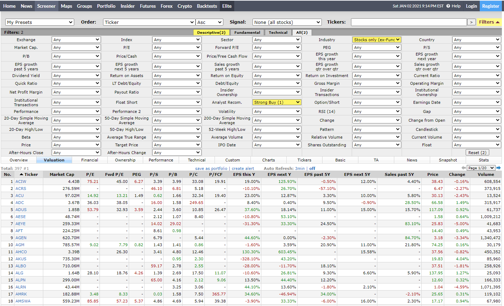

# pyfinviz
A python package to scrape data from finviz.com (inspired by https://github.com/lit26/finvizfinance).
This package uses a fixed set of parameter options so you don't have to memorize them. 
All methods return a pandas.DataFrame object.

## Usage
### Cryto
Information from https://finviz.com/crypto_performance.ashx. 
Uses relative performance options (D, W, M, MTD, Q, HY, Y, YTD)
```python
from pyfinviz.crypto import Crypto

# with no params (SECTOR, OVERVIEW by default)
table_info = Crypto.fetch()
# with params
table_info = Crypto.fetch(relative_performance_option=Crypto.RelativePerformanceOption.ONE_YEAR)
```

### Groups
Information from https://finviz.com/groups.ashx. Uses group options 
(Sector, Industry..., Capitalization) and view options (Overview, Valuation, Performace, Custom)
```python
from pyfinviz.groups import Groups

# with no params (sector overview)
table_info = Groups.fetch()
# with params (View the group VALUATION of the INDUSTRY sector)
table_info = Groups.fetch(group_option=Groups.GroupOption.INDUSTRY, view_option=Groups.ViewOption.VALUATION)
# with params (View the group PERFORMANCE of the TECH sector)
table_info = Groups.fetch(group_option=Groups.GroupOption.INDUSTRY_TECHNOLOGY, view_option=Groups.ViewOption.PERFORMANCE)
```

### Insider
Information from https://finviz.com/insidertrading.ashx. Uses filter options 
(BUY, SELL, ALL) and view options (LATEST, TOP_INSIDER_TRADING_RECENT_WEEK, ...)
```python
from pyfinviz.insider import Insider

# with no params (ALL the LATEST insider trades)
table_info = Insider.fetch()
# with params (the LATEST BUY insider trades)
table_info = Insider.fetch(filter_option=Insider.FilterOption.BUY)
```

### Screener
Information from https://finviz.com/screener.ashx?ft=4. The Screener class uses 
ALL the options (dropdowns) in the webpage mentioned in the last sentence (over 60), and uses
view options (OVERVIEW, VALUATION, ..., CUSTOM)
```python
from pyfinviz.screener import Screener

# with no params (default screener table)
table_info = Screener.fetch()
# with params (The first 3 pages of "STOCKS ONLY" where Analyst recommend a strong buy)
options = [Screener.IndustryOption.STOCKS_ONLY_EX_FUNDS, Screener.AnalystRecomOption.STRONG_BUY_1]
table_info = Screener.fetch(filter_options=options, view_option=Screener.ViewOption.VALUATION, pages=[x for x in range(1, 4)])
```
Screener output from previous fetch:


## ISSUES:
* Missing endpoint for https://finviz.com/quote.ashx
* Missing endpoint for https://finviz.com/news.ashx
* No PyPI hosting
* More?